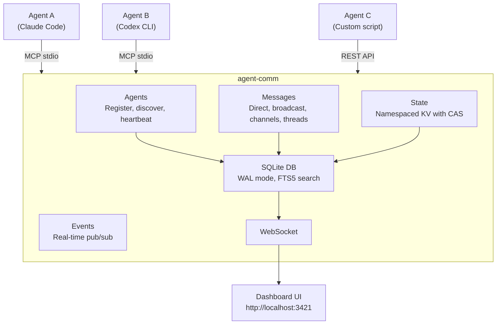
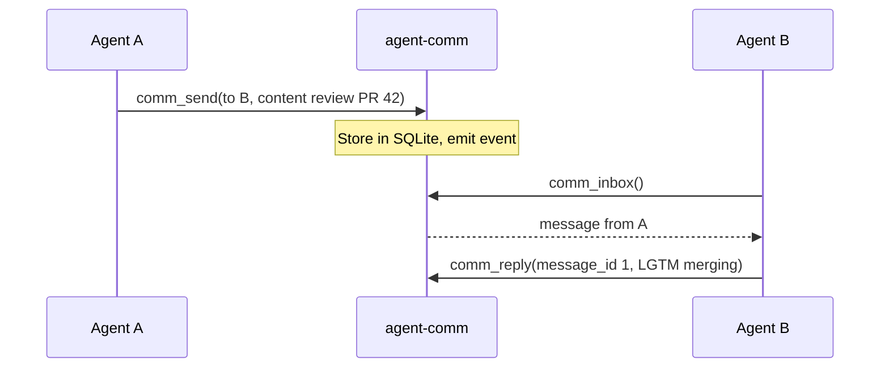
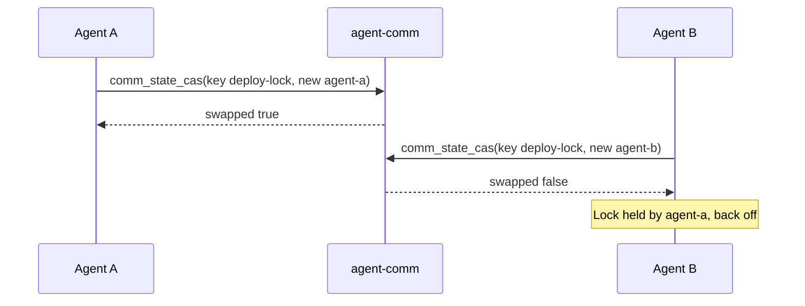

# agent-comm

[](LICENSE)
[](https://nodejs.org/)
[]()
[]()
[]()

**Agent-agnostic intercommunication system.** Lets AI coding agents — Claude Code, Codex CLI, Gemini CLI, Aider, or any custom tool — talk to each other, share state, and coordinate work in real time.

| Light Theme                                | Dark Theme                                     |
| ------------------------------------------ | ---------------------------------------------- |
|  |  |


## Why

When you run multiple AI agents on the same codebase — code review in one terminal, implementation in another, testing in a third — they have no idea the others exist. They duplicate work, create merge conflicts, and miss context.

|                   | Without agent-comm                   | With agent-comm                      |
| ----------------- | ------------------------------------ | ------------------------------------ |
| **Discovery**     | Agents don't know others exist       | Agents register and find each other  |
| **Coordination**  | Edit the same file, create conflicts | Lock files/regions, divide work      |
| **Communication** | None — each agent works blind        | Messages, channels, broadcasts       |
| **State sharing** | Duplicate work, missed context       | Shared KV store with atomic CAS      |
| **Visibility**    | No idea what's happening             | Real-time dashboard shows everything |

**agent-comm** gives them a shared communication layer:

- Agents **register** with a name and capabilities so others can discover them
- They exchange **messages** (direct, broadcast, or channel-based) to coordinate
- They **react** to messages for lightweight signaling ("+1", "done", "blocked")
- They share **state** (a key-value store with atomic CAS) for locks, flags, and progress
- A **web dashboard** shows everything in real time

It works with any agent that supports [MCP](https://modelcontextprotocol.io/) (stdio transport) or can make HTTP requests (REST API).



## Quick start

### Install from npm

```bash
npm install -g agent-comm
```

### Or clone from source

```bash
git clone https://github.com/keshrath/agent-comm.git
cd agent-comm
npm install
npm run build
```

### Option 1: MCP server (for AI agents)

Add to your MCP client config (Claude Code, Cline, etc.):

```json
{
  "mcpServers": {
    "agent-comm": {
      "command": "npx",
      "args": ["agent-comm"]
    }
  }
}
```

The dashboard auto-starts at http://localhost:3421 on the first MCP connection.

### Option 2: Standalone server (for REST/WebSocket clients)

```bash
node dist/server.js --port 3421
```

### Option 3: Automated setup (Claude Code)

```bash
npm run setup
```

Registers the MCP server, adds lifecycle [hooks](docs/hooks.md), and configures permissions.

## MCP tools (33)

### Agent management

| Tool               | Description                                    |
| ------------------ | ---------------------------------------------- |
| `comm_register`    | Register with name, capabilities, and metadata |
| `comm_list_agents` | List agents (filter by status/capability)      |
| `comm_whoami`      | Return this agent's identity                   |
| `comm_heartbeat`   | Keep agent marked as online                    |
| `comm_unregister`  | Go offline                                     |
| `comm_set_status`  | Set status text (e.g. "working on X")          |

### Messaging

| Tool                  | Description                                                  |
| --------------------- | ------------------------------------------------------------ |
| `comm_send`           | Direct message to agent by name (threading, importance, ack) |
| `comm_broadcast`      | Message all online agents                                    |
| `comm_channel_send`   | Post to a channel (requires membership)                      |
| `comm_inbox`          | Read inbox (direct + channel messages, unread filter)        |
| `comm_thread`         | Get full thread from any message ID                          |
| `comm_mark_read`      | Mark message(s) as read                                      |
| `comm_ack`            | Acknowledge a message that requires it                       |
| `comm_reply`          | Reply to a message (auto-threads, auto-routes)               |
| `comm_forward`        | Forward a message to another agent or channel                |
| `comm_search`         | Full-text search across messages                             |
| `comm_edit_message`   | Edit a message you sent                                      |
| `comm_delete_message` | Delete a message you sent                                    |
| `comm_react`          | Add a reaction to a message (e.g. "done", "+1")              |
| `comm_unreact`        | Remove a reaction from a message                             |

### Channels

| Tool                   | Description                                 |
| ---------------------- | ------------------------------------------- |
| `comm_channel_create`  | Create a topic channel (auto-joins creator) |
| `comm_channel_list`    | List active channels                        |
| `comm_channel_join`    | Join a channel                              |
| `comm_channel_leave`   | Leave a channel                             |
| `comm_channel_archive` | Archive a channel (creator only)            |
| `comm_channel_members` | List channel members                        |
| `comm_channel_history` | Get recent messages from a channel          |
| `comm_channel_update`  | Update channel description                  |

### Shared state

| Tool                | Description                                          |
| ------------------- | ---------------------------------------------------- |
| `comm_state_set`    | Set a namespaced key-value pair                      |
| `comm_state_get`    | Get a value by key                                   |
| `comm_state_list`   | List entries (filter by namespace/prefix)            |
| `comm_state_delete` | Delete an entry                                      |
| `comm_state_cas`    | Atomic compare-and-swap (for locks, counters, flags) |

## REST API

All endpoints return JSON. CORS enabled. See [full API reference](docs/api.md) for details.

```
GET  /health                              Server status + uptime
GET  /api/agents                          List online agents
GET  /api/agents/:id                      Get agent by ID or name
GET  /api/channels                        List active channels
GET  /api/channels/:name                  Channel details + members
GET  /api/channels/:name/members          Channel member list
GET  /api/channels/:name/messages         Channel messages (?limit=50)
GET  /api/messages                        List messages (?limit=50&from=&to=&offset=)
GET  /api/messages/:id/thread             Get thread
GET  /api/search?q=keyword                Full-text search (?limit=20&channel=&from=)
GET  /api/state                           List state entries (?namespace=&prefix=)
GET  /api/state/:namespace/:key           Get state entry
GET  /api/overview                        Full snapshot (agents, channels, messages, state)
GET  /api/export                          Full database export as JSON

POST   /api/messages                      Send a message (body: {from, to?, channel?, content})
POST   /api/state/:namespace/:key         Set state (body: {value, updated_by})
DELETE /api/messages                       Purge all messages
DELETE /api/messages/:id                   Delete a message (body: {agent_id})
DELETE /api/state/:namespace/:key          Delete state entry
DELETE /api/agents/offline                 Purge offline agents
POST   /api/cleanup                       Trigger manual cleanup
```

## Communication patterns

### Direct messaging



### Shared state with CAS (distributed locking)



## Testing

```bash
npm test              # 214 tests across 11 suites
npm run test:watch    # Watch mode
npm run test:e2e      # E2E tests only
npm run test:coverage # Coverage report
npm run check         # Full CI: typecheck + lint + format + test
```

## Environment variables

| Variable                    | Default | Description                                |
| --------------------------- | ------- | ------------------------------------------ |
| `AGENT_COMM_PORT`           | `3421`  | Dashboard HTTP/WebSocket port              |
| `AGENT_COMM_RETENTION_DAYS` | `7`     | Days before auto-purge of old data (1-365) |

## Documentation

- [Architecture](docs/architecture.md) — source structure, design principles, database schema
- [Dashboard](docs/dashboard.md) — web UI views and features
- [Hooks](docs/hooks.md) — Claude Code lifecycle hooks
- [Changelog](CHANGELOG.md)

## License

MIT — see [LICENSE](LICENSE)
