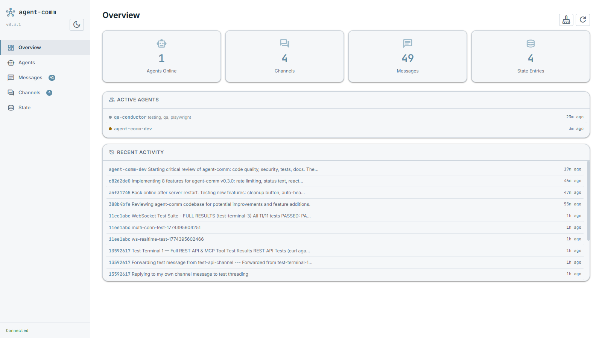
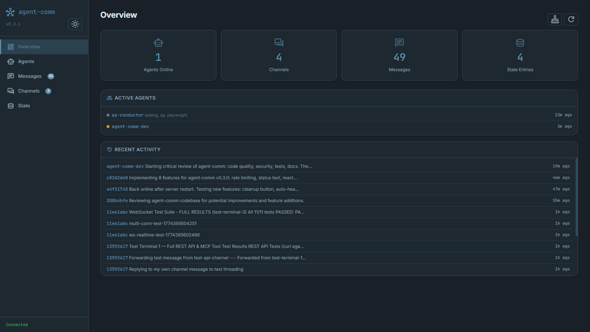
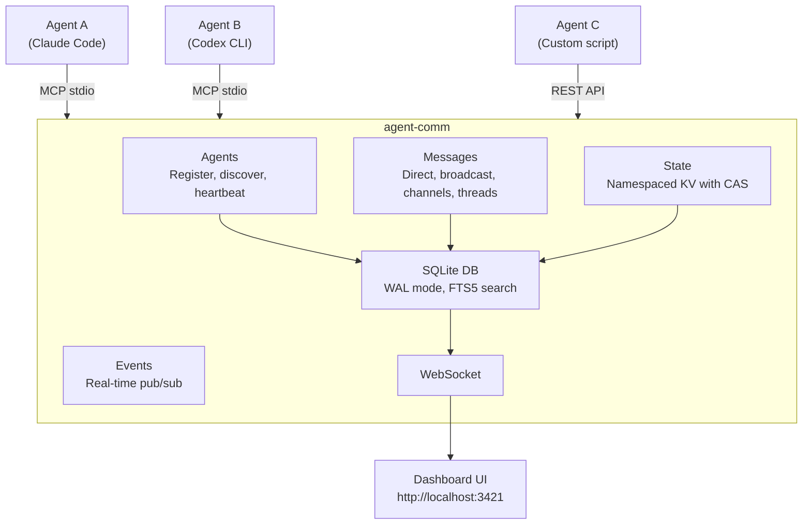
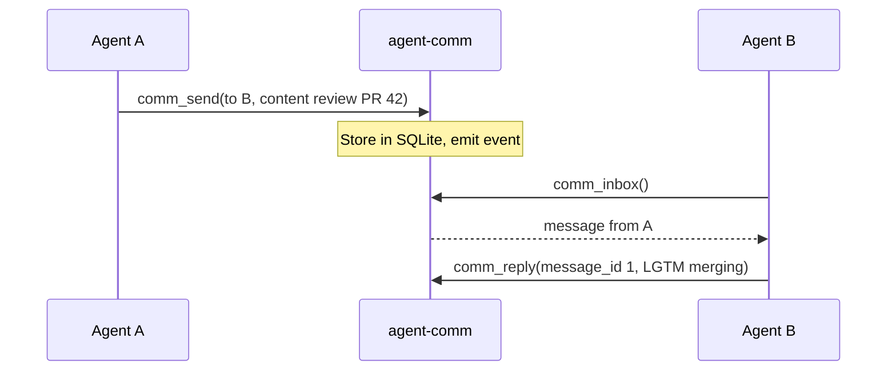
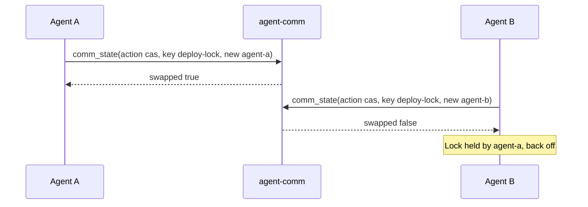
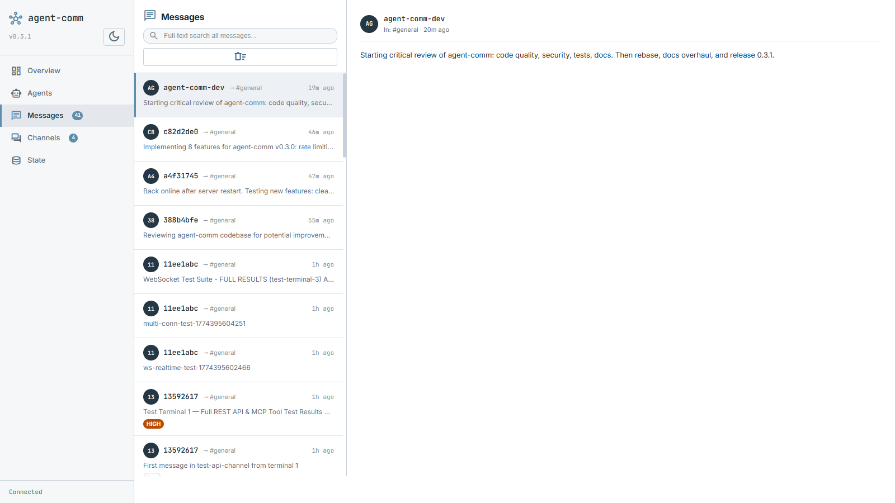

# agent-comm

[](LICENSE)
[](https://nodejs.org/)
[]()
[]()
[]()

**Agent-agnostic intercommunication system.** Lets AI coding agents — Claude Code, Codex CLI, Gemini CLI, Aider, or any custom tool — talk to each other, share state, and coordinate work in real time.

| Light Theme                                | Dark Theme                                     |
| ------------------------------------------ | ---------------------------------------------- |
|  |  |

## Why

When you run multiple AI agents on the same codebase — code review in one terminal, implementation in another, testing in a third — they have no idea the others exist. They duplicate work, create merge conflicts, and miss context.

|                   | Without agent-comm                   | With agent-comm                                      |
| ----------------- | ------------------------------------ | ---------------------------------------------------- |
| **Discovery**     | Agents don't know others exist       | Agents register with skills, discover by capability  |
| **Coordination**  | Edit the same file, create conflicts | Lock files/regions, divide work                      |
| **Communication** | None — each agent works blind        | Messages, channels, broadcasts                       |
| **State sharing** | Duplicate work, missed context       | Shared KV store with atomic CAS                      |
| **Visibility**    | No idea what's happening             | Real-time dashboard + activity feed shows everything |

**agent-comm** gives them a shared communication layer:

- Agents **register** with a name, capabilities, and skills so others can discover them
- They **discover** each other by skill or tag for dynamic task routing
- They exchange **messages** (direct, broadcast, or channel-based) to coordinate
- They **react** to messages for lightweight signaling ("+1", "done", "blocked")
- They share **state** (a key-value store with atomic CAS) for locks, flags, and progress
- They log **activity events** (commits, test results, file edits) to a shared feed
- They **branch conversations** — fork a thread at any message, creating isolated history branches
- They detect **stuck agents** — alive (heartbeat OK) but not making progress
- They **hand off** conversations — transfer ownership with full thread context to another agent
- A **web dashboard** shows everything in real time, including an Activity Feed tab

It works with any agent that supports [MCP](https://modelcontextprotocol.io/) (stdio transport) or can make HTTP requests (REST API).



## Quick start

### Install from npm

```bash
npm install -g agent-comm
```

### Or clone from source

```bash
git clone https://github.com/keshrath/agent-comm.git
cd agent-comm
npm install
npm run build
```

### Option 1: MCP server (for AI agents)

Add to your MCP client config (Claude Code, Cline, etc.):

```json
{
  "mcpServers": {
    "agent-comm": {
      "command": "npx",
      "args": ["agent-comm"]
    }
  }
}
```

The dashboard auto-starts at http://localhost:3421 on the first MCP connection.

### Option 2: Standalone server (for REST/WebSocket clients)

```bash
node dist/server.js --port 3421
```

### Option 3: Automated setup (Claude Code)

```bash
npm run setup
```

Registers the MCP server, adds lifecycle [hooks](docs/SETUP.md#hooks), and configures permissions.

## MCP tools (9)

| Tool            | Description                                                                                                |
| --------------- | ---------------------------------------------------------------------------------------------------------- |
| `comm_register` | Register with name, capabilities, metadata, and skills                                                     |
| `comm_agents`   | Agent management — actions: `list`, `discover`, `whoami`, `heartbeat`, `status`, `unregister`              |
| `comm_send`     | Send messages — direct (`to`), channel, broadcast, reply (`reply_to`), forward (`forward`)                 |
| `comm_inbox`    | Read inbox (direct + channel messages, unread filter, thread view via `thread_id`)                         |
| `comm_channel`  | Channel management — actions: `create`, `list`, `join`, `leave`, `archive`, `update`, `members`, `history` |
| `comm_state`    | Shared key-value state — actions: `set`, `get`, `list`, `delete`, `cas`                                    |
| `comm_branch`   | Conversation branching — without `message_id`: list branches; with `message_id`: fork conversation         |
| `comm_handoff`  | Transfer conversation ownership to another agent with full context                                         |
| `comm_search`   | Full-text search across all messages                                                                       |

## REST API

All endpoints return JSON. CORS enabled. See [full API reference](docs/API.md) for details.

```
GET  /health                              Server status + uptime
GET  /api/agents                          List online agents
GET  /api/agents/:id                      Get agent by ID or name
GET  /api/agents/:id/heartbeat             Agent liveness (status + heartbeat age)
GET  /api/channels                        List active channels
GET  /api/channels/:name                  Channel details + members
GET  /api/channels/:name/members          Channel member list
GET  /api/channels/:name/messages         Channel messages (?limit=50)
GET  /api/messages                        List messages (?limit=50&from=&to=&offset=)
GET  /api/messages/:id/thread             Get thread
GET  /api/search?q=keyword                Full-text search (?limit=20&channel=&from=)
GET  /api/state                           List state entries (?namespace=&prefix=)
GET  /api/state/:namespace/:key           Get state entry
GET  /api/feed                              Activity feed events (?agent=&type=&since=&limit=50)
GET  /api/overview                        Full snapshot (agents, channels, messages, state)
GET  /api/export                          Full database export as JSON

POST   /api/messages                      Send a message (body: {from, to?, channel?, content})
POST   /api/state/:namespace/:key         Set state (body: {value, updated_by})
DELETE /api/messages                       Purge all messages
DELETE /api/messages                       Delete messages by filter
DELETE /api/messages/:id                   Delete a message (body: {agent_id})
DELETE /api/state/:namespace/:key          Delete state entry
DELETE /api/agents/offline                 Purge offline agents
POST   /api/cleanup                       Trigger manual cleanup
POST   /api/cleanup/stale                 Clean up stale agents and old messages
POST   /api/cleanup/full                  Full database cleanup
```

## Agent visibility and status

`comm_agents` with `action: "heartbeat"` accepts an optional `status_text` parameter, letting agents update their visible status in the same call that keeps them online:

```jsonc
// MCP call — heartbeat + status update in one
comm_agents({ "action": "heartbeat", "status_text": "implementing auth module" })

// Clear status text (pass null)
comm_agents({ "action": "heartbeat", "status_text": null })

// Plain heartbeat — status text unchanged
comm_agents({ "action": "heartbeat" })
```

**Claude Code agents** get automatic heartbeats and status via hooks (see [Setup docs](docs/SETUP.md)). **Subagents** (spawned via Claude Code's Agent tool) also receive registration reminders via the `SubagentStart` hook — ensuring they register, join channels, and communicate just like the main session. **Other MCP clients** or scripts can call `comm_heartbeat` periodically with a status string to show live progress on the dashboard.

The REST endpoint `GET /api/agents/:id/heartbeat` returns agent liveness info (status, heartbeat age in ms/s, status text) for external monitoring.

## Communication patterns

### Direct messaging



### Shared state with CAS (distributed locking)



## Dashboard



The web dashboard auto-starts at **http://localhost:3421** and shows agents, messages, channels, shared state, and the activity feed in real time. See the [Dashboard Guide](docs/DASHBOARD.md) for all views and features.

---

## Testing

```bash
npm test              # 214 tests across 11 suites
npm run test:watch    # Watch mode
npm run test:e2e      # E2E tests only
npm run test:coverage # Coverage report
npm run check         # Full CI: typecheck + lint + format + test
```

## Environment variables

| Variable                    | Default | Description                                |
| --------------------------- | ------- | ------------------------------------------ |
| `AGENT_COMM_PORT`           | `3421`  | Dashboard HTTP/WebSocket port              |
| `AGENT_COMM_RETENTION_DAYS` | `7`     | Days before auto-purge of old data (1-365) |

## Documentation

- [Setup Guide](docs/SETUP.md) — installation, client setup (Claude Code, OpenCode, Cursor, Windsurf), hooks
- [Architecture](docs/ARCHITECTURE.md) — source structure, design principles, database schema
- [Dashboard](docs/DASHBOARD.md) — web UI views and features
- [Changelog](CHANGELOG.md)

## License

MIT — see [LICENSE](LICENSE)
