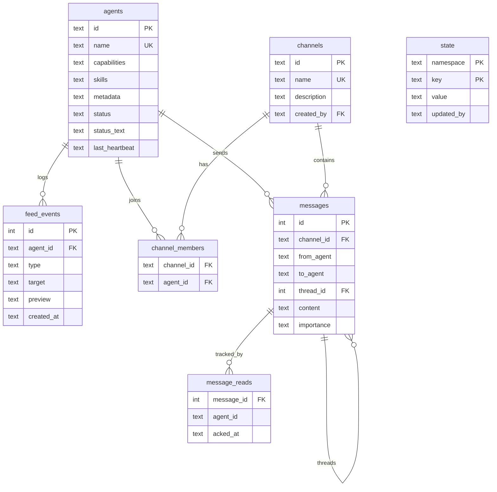

# Architecture

## Source structure

```
src/
├── types.ts              # Shared types, error hierarchy (CommError → NotFound/Conflict/Validation)
├── context.ts            # DI root — creates and wires all services, no global state
├── index.ts              # MCP entry point (stdio JSON-RPC) + dashboard auto-start
├── server.ts             # HTTP + WebSocket server (standalone or embedded)
├── storage/
│   └── database.ts       # SQLite wrapper: WAL mode, versioned migrations, parameterized queries
├── domain/
│   ├── agents.ts         # Registration, presence, skill discovery, heartbeat reaper, stuck detection
│   ├── branches.ts       # Conversation branching — fork threads at any message point
│   ├── feed.ts           # Activity feed — structured event logging and querying
│   ├── channels.ts       # Channel lifecycle, membership, archiving
│   ├── messages.ts       # Send/receive, threading, read/ack, FTS5 search, broadcast
│   ├── state.ts          # Namespaced KV with CAS, input validation
│   ├── events.ts         # Typed in-process event bus (pub/sub with wildcards)
│   ├── cleanup.ts        # Startup reset, periodic purge, manual message wipe
│   ├── rate-limit.ts     # Per-agent token bucket rate limiter
├── transport/
│   ├── mcp.ts            # 9 MCP tool definitions + dispatch + input validation
│   ├── rest.ts           # HTTP router (node:http, zero frameworks) + static serving
│   └── ws.ts             # WebSocket: real-time push, ping/pong, event filtering
└── ui/
    ├── index.html        # Dashboard SPA (ARIA, keyboard nav, Material Symbols)
    ├── styles.css        # Light/dark theme, responsive layout, prose markdown styles
    └── app.js            # Client: WebSocket, diff-aware rendering, markdown (marked + DOMPurify)
```

## Design principles

- **No global state** — everything flows through `AppContext` (dependency injection)
- **Domain-driven** — business logic in `domain/`, transports are thin adapters
- **3 runtime deps** — `better-sqlite3`, `uuid`, `ws`
- **Typed errors** — `CommError` hierarchy with HTTP status codes (400, 404, 409, 422, 429)
- **Input validation** — runtime type checking on all MCP tool inputs
- **Agent-gated access** — all tools require prior `comm_register` (except `comm_agents` list action)

## Message delivery model

Agents are **not** notified of new messages in real time. MCP is a request/response protocol — the server cannot push unsolicited messages to agents. Agents must poll via `comm_inbox` to check for new messages.

The **dashboard** gets real-time push via WebSocket, so humans can see messages arrive instantly. But MCP agents only learn about new messages when they actively call `comm_inbox`.

**How agents stay informed:**

- The `UserPromptSubmit` hook queries the database on every user message — if there are messages in the last 5 minutes, it tells the agent to call `comm_inbox`. This is the primary mechanism.
- The `SessionStart` hook includes `comm_inbox` as step 5 of the mandatory startup sequence
- Agents can call `comm_inbox` at the start of each task
- For time-critical coordination, use `comm_state({ action: "cas", ... })` (shared state with CAS) which agents can check synchronously

## Database

SQLite with WAL mode at `~/.agent-comm/agent-comm.db`. Schema is versioned with automatic migrations.



### Automatic cleanup

Runs hourly (retention configurable via `AGENT_COMM_RETENTION_DAYS`, default 7):

- Offline agents older than retention period are deleted
- Messages older than retention period are purged
- Archived channels older than retention period are removed
- Orphan read receipts are cleaned up
- State entries older than retention period are removed
- On startup, agents with stale heartbeats (>2 min) are marked offline

### Rate limiting

Per-agent token bucket rate limiter on message sending:

- **Capacity:** 10 tokens (burst size)
- **Refill:** 1 token/second (60 messages/min sustained)
- Applied to `comm_send` (all modes: direct, broadcast, channel)
- Returns HTTP 429 / error code `RATE_LIMITED` when exceeded

## Development

```bash
npm run dev          # Live reload (tsc watch + nodemon)
npm run dev:mcp      # TypeScript watch only (for MCP testing)
npm run lint         # ESLint
npm run lint:fix     # ESLint with auto-fix
npm run format       # Prettier
npm run typecheck    # TypeScript strict mode check
npm run check        # Full CI: typecheck + lint + format + test
```

## Test suites

| Suite                  | Tests | What it covers                                                        |
| ---------------------- | ----- | --------------------------------------------------------------------- |
| Domain: Agents         | 16    | Registration, discovery, heartbeat, reaper, validation                |
| Domain: Messages       | 22    | Send, inbox, threads, read/ack, search, edit/delete, broadcast        |
| Domain: Channels       | 12    | Create, join/leave, archive, membership enforcement                   |
| Domain: State          | 19    | CRUD, namespaces, CAS, key validation                                 |
| Domain: Events         | 7     | Pub/sub, wildcards, unsubscribe, error isolation                      |
| Domain: Rate limit     | 6     | Token bucket capacity, refill, isolation, reset                       |
| Domain: Edge cases     | 43    | Boundary values, injection prevention, concurrency, data integrity    |
| Transport: MCP         | 34    | All 9 tools, auth gates, rate limiting, input validation              |
| Integration: Workflows | 10    | Multi-agent scenarios (coordination, CAS locking, forwarding, search) |
| E2E: Server            | 21    | REST endpoints, WebSocket state/events, export, error codes           |
