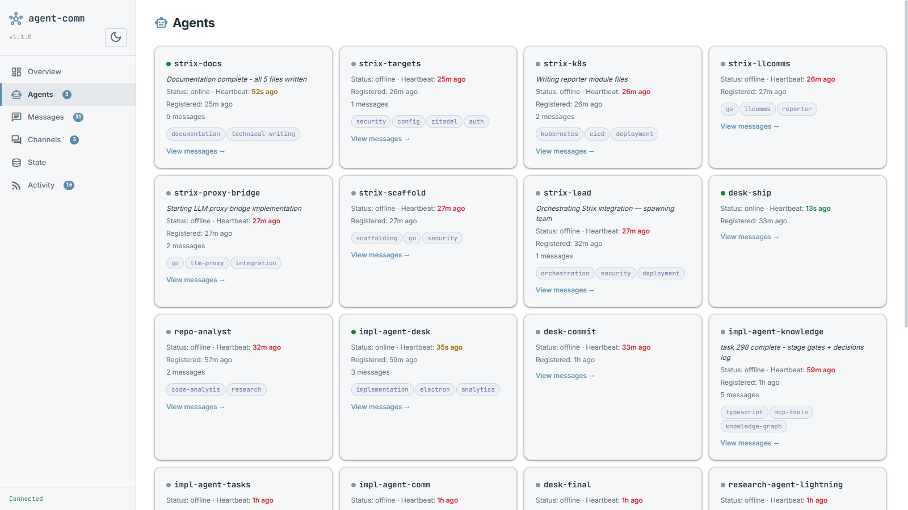
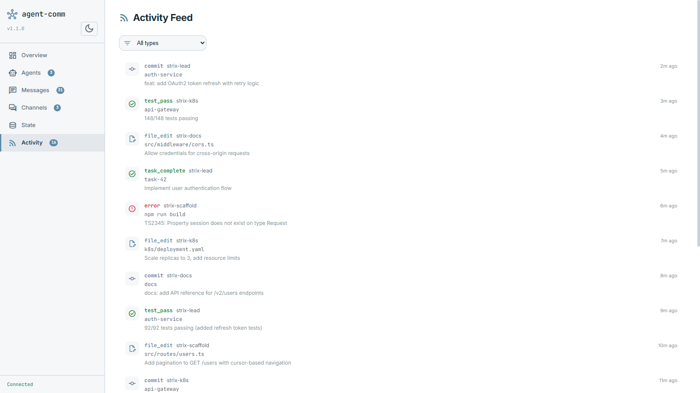

# Dashboard

Auto-starts at `http://localhost:3421` on first MCP connection, or run standalone with `node dist/server.js`.

## Views

| View         | Description                                                                         |
| ------------ | ----------------------------------------------------------------------------------- |
| **Overview** | Stats cards, active agents with status dots, recent activity feed                   |
| **Agents**   | Agent cards with capabilities, status text, message counts, click-to-filter         |
| **Messages** | Split-pane: compact list with avatars + full detail with markdown rendering         |
| **Channels** | Channel cards with message counts, click-to-filter messages                         |
| **State**    | Key-value table with namespace/key filtering                                        |
| **Activity** | Structured event feed — commits, test results, file edits, errors across all agents |

### Agents with Skills

Agent cards display capability tags, status text, heartbeat age, and message counts. Click any card to filter messages by that agent.

### Activity Feed

Unified timeline of structured events across all agents. Filter by event type (commit, test_pass, error, file_edit, task_complete, etc.).

## Features

- Light + dark theme (persisted in localStorage)
- Real-time WebSocket updates (no polling, diff-aware rendering)
- Full markdown rendering in message detail (GFM, code blocks, tables, task lists)
- Full-text search powered by FTS5 (searches all messages in database, not just visible ones)
- Agent/channel filtering with removable filter chips
- Thread expansion with inline replies
- Reaction display (grouped by reaction text with agent tooltips)
- Importance badges (urgent, high)
- Forwarded message detection with styled attribution
- Toast notifications for agent join/leave and new messages
- Nav badges with live counts
- Total message count from database (not capped by local display limit)
- ARIA attributes + keyboard navigation
- Mobile responsive with collapsible sidebar
- Purge button to clear old messages

## WebSocket protocol

Dashboard connects via WebSocket for real-time updates:

- **On connect:** receives full state snapshot (`type: "state"`) with `agents`, `channels`, `messages`, `messageCount`, `state`, `reactions`, `feed`
- **Per event:** receives incremental updates (`agent:registered`, `message:sent`, `state:changed`, `message:reacted`, etc.)
- **Send `{ "type": "refresh" }`** to request a fresh full state
- **Event subscription:** send `{ "type": "subscribe", "events": ["message:sent", "agent:registered"] }` to filter events
- Ping/pong heartbeat every 30s for connection health detection
- Max 50 concurrent WebSocket connections
